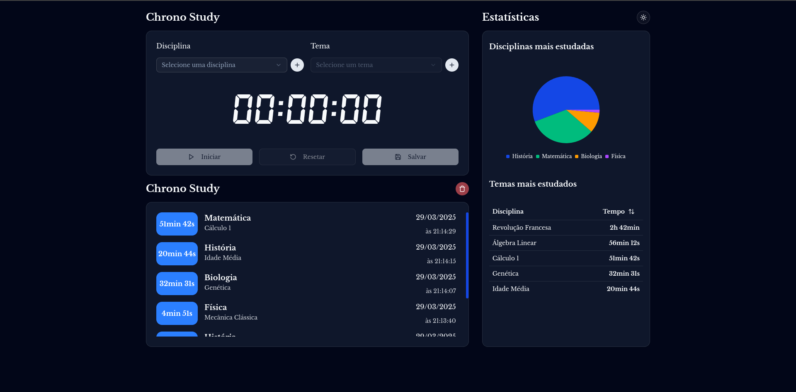

# Chrono Study

[](https://chrono-study.vercel.app/)
**Deploy**: [https://chrono-study.vercel.app/](https://chrono-study.vercel.app/)

Este é um projeto desenvolvido em **React** com **Next.js**, focado em gerenciamento de tempo e estudos. Ele utiliza uma estrutura modular e moderna, com suporte a temas (claro e escuro) e componentes reutilizáveis.

## 🚀 Tecnologias e Bibliotecas Utilizadas

- **Next.js**: Framework para renderização do lado do servidor (SSR) e geração de sites estáticos.
- **Tailwind CSS**: Framework de utilitários CSS para estilização rápida e responsiva.
- **ViewTransitionsAPI**: Nova API para transições de páginas suaves.
- **Framer Motion**: Animações e transições.
- **Storybook**: Biblioteca para criação da documentação dos componentes.
- **zod**: Biblioteca de validação e parsing de esquemas TypeScript-first, utilizada para garantir a integridade dos dados no projeto.
- **react-hook-form**: Biblioteca para gerenciamento de formulários, proporcionando uma experiência simples e eficiente.
- **next-themes**: Gerenciamento de temas (claro e escuro).
- **lucide-react**: Ícones modernos e leves.
- **HeroUI**: Biblioteca de componentes reutilizáveis e estilizáveis.
- **next/font**: Selecionado Poppins como fonte padrão do projeto.

## 🌟 Funcionalidades

- **Gerenciamento de tempo**: Controle de atividades com um cronômetro.
- **Histórico**: Visualização de atividades anteriores.
- **Gráfico**: Apresentação das disciplinas mais estudadas com um gráfico em formato de pizza.
- **Tema claro/escuro**: Alternância entre temas com suporte a persistência.

## 📂 Estrutura do Projeto

O projeto segue uma estrutura modular, com componentes organizados por página e reutilizáveis:

```plaintext
├─ .gitignore
├─ .idea
│  ├─ .gitignore
│  ├─ biome.xml
│  ├─ chrono-study.iml
│  ├─ codeStyles
│  │  ├─ Project.xml
│  │  └─ codeStyleConfig.xml
│  ├─ material_theme_project_new.xml
│  ├─ modules.xml
│  ├─ prettier.xml
│  └─ vcs.xml
├─ README.md
├─ biome.json
├─ bun.lock
├─ components.json
├─ dashboard.png
├─ jest.config.ts
├─ jest.setup.ts
├─ next.config.ts
├─ package.json
├─ postcss.config.mjs
├─ public
│  ├─ fonts
│  │  ├─ clockicons.woff
│  │  └─ clockicons.woff2
│  ├─ icon512_maskable.png
│  └─ icon512_rounded.png
├─ src
│  ├─ app
│  │  ├─ (home)
│  │  │  ├─ chrono
│  │  │  │  └─ page.tsx
│  │  │  ├─ components
│  │  │  │  ├─ AddDisciplineSubject.tsx
│  │  │  │  ├─ ChronoStudyCard.tsx
│  │  │  │  ├─ HighlightCard.tsx
│  │  │  │  ├─ HistoryCard.tsx
│  │  │  │  ├─ HistoryItem.tsx
│  │  │  │  ├─ HomePage.tsx
│  │  │  │  ├─ Statistics.tsx
│  │  │  │  ├─ StatisticsCard.tsx
│  │  │  │  ├─ Theme.tsx
│  │  │  │  ├─ Timer.tsx
│  │  │  │  └─ TimerMinimized.tsx
│  │  │  ├─ footer.tsx
│  │  │  ├─ header.tsx
│  │  │  ├─ layout.tsx
│  │  │  ├─ page.tsx
│  │  │  ├─ tests
│  │  │  │  ├─ AddDisciplineSubject.test.tsx
│  │  │  │  ├─ ChronoStudyCard.test.tsx
│  │  │  │  ├─ HistoryCard.test.tsx
│  │  │  │  ├─ HistoryItem.test.tsx
│  │  │  │  ├─ Statistics.test.tsx
│  │  │  │  ├─ Theme.test.tsx
│  │  │  │  └─ Timer.test.tsx
│  │  │  └─ utils.tsx
│  │  ├─ favicon.ico
│  │  ├─ layout.tsx
│  │  ├─ manifest.json
│  │  └─ providers.tsx
│  ├─ assets
│  │  ├─ images
│  │  │  └─ icon.png
│  │  └─ styles
│  │     └─ globals.css
│  ├─ components
│  │  ├─ TitlebarButtons.tsx
│  │  ├─ navbar.tsx
│  │  ├─ providers
│  │  │  └─ theme-provider.tsx
│  │  ├─ table
│  │  │  ├─ functions.ts
│  │  │  ├─ hook.ts
│  │  │  ├─ index.tsx
│  │  │  └─ types.ts
│  │  └─ ui
│  │     ├─ card.tsx
│  │     └─ chart.tsx
│  ├─ config
│  │  ├─ fonts.ts
│  │  └─ site.ts
│  ├─ hero.ts
│  ├─ lib
│  │  ├─ discipline-data.ts
│  │  └─ utils.ts
│  ├─ store
│  │  ├─ disciplineStore.ts
│  │  ├─ focusStore.ts
│  │  ├─ timerMinimized.ts
│  │  └─ timerStore.ts
│  └─ types
│     └─ index.ts
├─ tsconfig.json
└─ yarn.lock
```

### Principais Componentes

- **ChronoStudy**: Componente principal para gerenciamento de tempo.
- **Timer**: Subcomponente para controle de contagem regressiva.
- **History**: Exibe o histórico de atividades.
- **Statistics**: Exibe um resumo das disciplinas e temas mais estudados.

## 🛠️ Como executar o projeto

### Pré-requisitos

Certifique-se de ter instalado:

- **Node.js** (versão 16 ou superior)
- **yarn** ou **npm**

### Passos para executar

1. Clone o repositório:
   ```bash
   git clone https://github.com/levigleik/chrono-study.git
   cd chrono-study
   ```
2. Instale as dependências:

   ```
   yarn install
   # ou
   npm install
   ```

3. Inicie o servidor de desenvolvimento:

   ```
   yarn dev
   # ou
   npm run dev
   ```

4. Abra o navegador e acesse:
   ```
   http://localhost:3000
   ```

## 📦 Scripts Disponíveis

- dev: Inicia o servidor de desenvolvimento.
- build: Gera a build de produção.
- start: Inicia o servidor em modo de produção.
- lint: Verifica o código com ESLint.
- storybook: Inicia o Storybook.
- build-storybook: Gera a build do Storybook.
- test: Realiza testes com Jest e React Testing Library.
